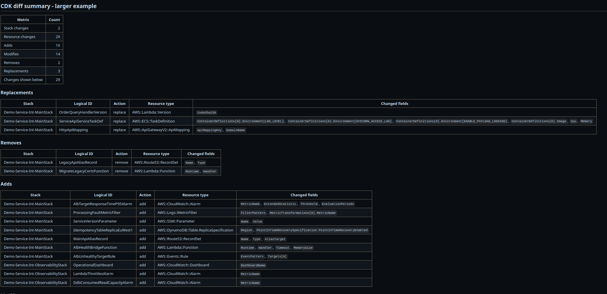

# cdk-diff-summary

`cdk-diff-summary` is a standalone composite GitHub Action that reads AWS CDK diff JSON and appends a compact Markdown summary to `$GITHUB_STEP_SUMMARY`.

It is designed for pull requests where raw CDK or CloudFormation diffs are too noisy. The summary groups adds, modifies, removes, replacements, and other changes while reducing common churn from IAM policy documents and CDK asset hashes.

The action deliberately shows changed field paths only, not before/after values, to avoid exposing sensitive infrastructure values in GitHub summaries.

## Usage

```yaml
- name: Generate CDK diff JSON
  run: npx cdk diff --json > cdk-diff.json

- name: Summarize CDK diff
  uses: your-org/cdk-diff-summary@v1
  with:
    diff-json-path: cdk-diff.json
```

## Inputs

| Input                   | Required | Default            | Description                                                                                                                                                         |
| ----------------------- | -------- | ------------------ | ------------------------------------------------------------------------------------------------------------------------------------------------------------------- |
| `diff-json-path`        | yes      |                    | Path to JSON produced by `cdk diff --json`.                                                                                                                         |
| `summary-title`         | no       | `CDK diff summary` | Markdown heading for the summary.                                                                                                                                   |
| `max-changed-fields`    | no       | `8`                | Maximum changed field paths shown per resource.                                                                                                                     |
| `collapse-iam-policies` | no       | `true`             | Collapse large IAM policy document diffs to a single path such as `PolicyDocument`.                                                                                 |
| `collapse-assets`       | no       | `true`             | Suppress or collapse common CDK asset/hash churn such as asset hashes, S3 object keys, Lambda code hashes, Docker image asset hashes, and CDK metadata asset paths. |
| `fail-on-remove`        | no       | `false`            | Write the summary, then fail the step if visible removes exist.                                                                                                     |
| `fail-on-replace`       | no       | `false`            | Write the summary, then fail the step if visible replacements exist.                                                                                                |
| `summary-output-path`   | no       |                    | Optional file path to also append the generated Markdown summary.                                                                                                   |

## Example Output



```markdown
## CDK diff summary

| Metric              | Count |
| ------------------- | ----: |
| Stack changes       |     1 |
| Resource changes    |     3 |
| Adds                |     1 |
| Modifies            |     1 |
| Removes             |     0 |
| Replacements        |     1 |
| Changes shown below |     3 |

### Replacements

| Stack         | Logical ID | Action  | Resource type         | Changed fields                |
| ------------- | ---------- | ------- | --------------------- | ----------------------------- |
| PaymentsStack | Worker     | replace | AWS::Lambda::Function | `Architectures[]`, `Layers[]` |
```

## Local Development

```bash
poetry install
```

Run the script directly:

```bash
DIFF_JSON_PATH=../example_cdk_diff_json/cdk-diff-json-tiny.json \
GITHUB_STEP_SUMMARY=/tmp/cdk-summary.md \
python scripts/cdk_diff_summary.py
```

Run tests and linting:

```bash
poetry run test
poetry run ruff check .
```

CDK diff JSON shape can vary by CDK version. If parsing fails, please open an issue with a sanitized example of the JSON shape that failed.
